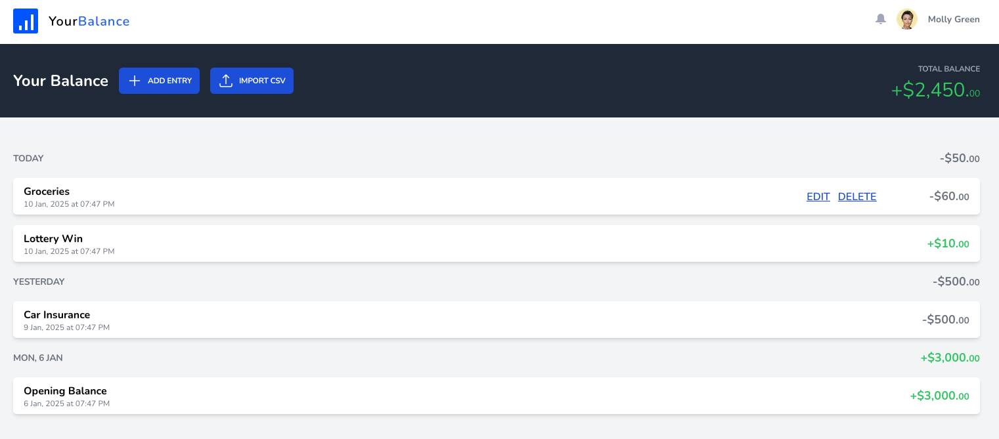

# Finance App

Built with Laravel, Inertia, Vue.js 3 and using Laravel Reverb


```bash
cp .env.example .env
composer install
php artisan key:generate
touch database/database.sqlite
php artisan migrate:fresh --seed
npm i && npm run build
php artisan reverb:start
```

You'll need to run `php artisan reverb:install` once to populate the `REVERB_` variables in .env file.

You can login using `admin@finance-app.test/password`
